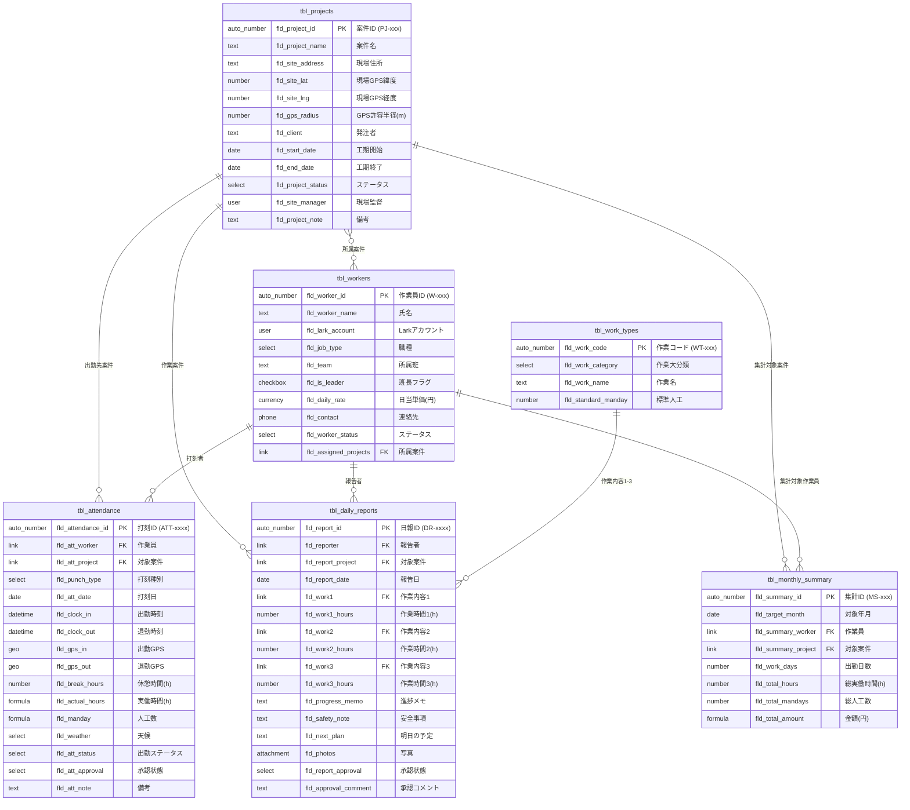

# ER図（Entity-Relationship Diagram）

建設業向け勤怠・日報テンプレート -- Lark Bitable テーブル間のリレーションを示すER図

本ドキュメントでは、6つのテーブル間の関連性をMermaid形式で視覚化する。
テーブル設計書（01-table-schema.md）で定義された全テーブルとリレーションを網羅している。

---

## ER図



---

## リレーション説明

### 1. 案件マスタ (tbl_projects) と 作業員マスタ (tbl_workers) -- 多対多

| 項目 | 内容 |
|------|------|
| カーディナリティ | 多対多 (M:N) |
| 結合フィールド | `tbl_workers.fld_assigned_projects` → `tbl_projects.fld_project_id` |
| 説明 | 1人の作業員は複数の案件に所属でき、1つの案件には複数の作業員が配属される。Lark Bitableのリンクフィールド（複数選択可）で実現している。 |

### 2. 出退勤記録 (tbl_attendance) と 作業員マスタ (tbl_workers) -- 多対1

| 項目 | 内容 |
|------|------|
| カーディナリティ | 多対1 (N:1) |
| 結合フィールド | `tbl_attendance.fld_att_worker` → `tbl_workers.fld_worker_id` |
| 説明 | 各出退勤記録は1人の作業員に紐づく。1人の作業員は複数の出退勤記録を持つ。 |

### 3. 出退勤記録 (tbl_attendance) と 案件マスタ (tbl_projects) -- 多対1

| 項目 | 内容 |
|------|------|
| カーディナリティ | 多対1 (N:1) |
| 結合フィールド | `tbl_attendance.fld_att_project` → `tbl_projects.fld_project_id` |
| 説明 | 各出退勤記録は1つの案件に紐づく。1つの案件には複数の出退勤記録が発生する。GPS座標と案件の現場座標を比較し、許容半径内かチェックする。 |

### 4. 日報 (tbl_daily_reports) と 作業員マスタ (tbl_workers) -- 多対1

| 項目 | 内容 |
|------|------|
| カーディナリティ | 多対1 (N:1) |
| 結合フィールド | `tbl_daily_reports.fld_reporter` → `tbl_workers.fld_worker_id` |
| 説明 | 各日報は1人の作業員（報告者）に紐づく。1人の作業員は日々日報を提出するため、複数の日報レコードを持つ。 |

### 5. 日報 (tbl_daily_reports) と 案件マスタ (tbl_projects) -- 多対1

| 項目 | 内容 |
|------|------|
| カーディナリティ | 多対1 (N:1) |
| 結合フィールド | `tbl_daily_reports.fld_report_project` → `tbl_projects.fld_project_id` |
| 説明 | 各日報は1つの案件に紐づく。1つの案件には複数の日報が蓄積される。 |

### 6. 日報 (tbl_daily_reports) と 作業内容マスタ (tbl_work_types) -- 多対1（3リンク）

| 項目 | 内容 |
|------|------|
| カーディナリティ | 多対1 (N:1) x 3 |
| 結合フィールド | `tbl_daily_reports.fld_work1` → `tbl_work_types.fld_work_code` |
|  | `tbl_daily_reports.fld_work2` → `tbl_work_types.fld_work_code` |
|  | `tbl_daily_reports.fld_work3` → `tbl_work_types.fld_work_code` |
| 説明 | 各日報は最大3つの作業内容を参照できる。作業内容1は必須、作業内容2・3は任意。同一の作業内容マスタレコードが複数の日報から参照される。 |

### 7. 工数集計 (tbl_monthly_summary) と 作業員マスタ (tbl_workers) -- 多対1

| 項目 | 内容 |
|------|------|
| カーディナリティ | 多対1 (N:1) |
| 結合フィールド | `tbl_monthly_summary.fld_summary_worker` → `tbl_workers.fld_worker_id` |
| 説明 | 各工数集計レコードは1人の作業員に紐づく。1人の作業員は月ごと・案件ごとに集計レコードが作成されるため、複数の集計レコードを持つ。 |

### 8. 工数集計 (tbl_monthly_summary) と 案件マスタ (tbl_projects) -- 多対1

| 項目 | 内容 |
|------|------|
| カーディナリティ | 多対1 (N:1) |
| 結合フィールド | `tbl_monthly_summary.fld_summary_project` → `tbl_projects.fld_project_id` |
| 説明 | 各工数集計レコードは1つの案件に紐づく。1つの案件には月ごと・作業員ごとに複数の集計レコードが存在する。金額は「総人工数 x 日当単価（T2からルックアップ）」で算出される。 |

---

## リレーション概要図（テキスト版）

```
                    +-------------------+
                    | T3: 作業内容マスタ |
                    | tbl_work_types    |
                    +--------+----------+
                             |
                             | 作業内容1~3 (N:1 x3)
                             |
+----------------+    +------v-----------+    +------------------+
| T1: 案件マスタ  |<---| T5: 日報          |<---| T2: 作業員マスタ  |
| tbl_projects   |    | tbl_daily_reports |    | tbl_workers      |
+---+------+-----+    +------------------+    +---+---------+----+
    |      |                                      |         |
    |      |    +------------------+              |         |
    |      +----| T4: 出退勤記録    |--------------+         |
    |           | tbl_attendance   |                        |
    |           +------------------+                        |
    |                                                       |
    |           +------------------+                        |
    +-----------| T6: 工数集計      |------------------------+
                | tbl_monthly_     |
                | summary          |
                +------------------+

T1 <--M:N--> T2  (所属案件リンク)
```

---

*最終更新: 2026-02-25*
